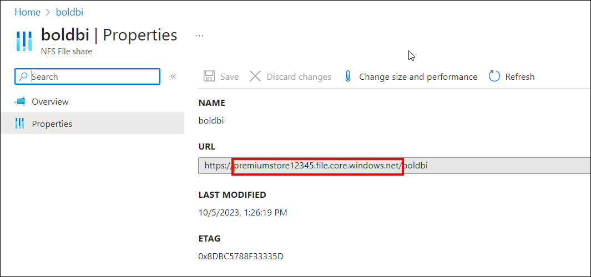
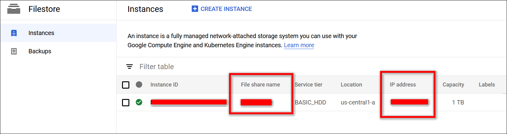
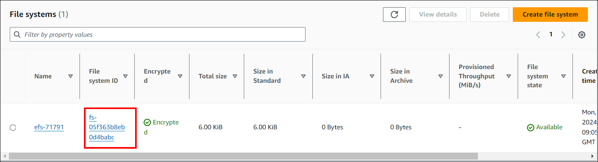

# Persistent Volumes
1. AKS File Storage
2. Google Kubernetes Engine (GKE)
3. Amazon Elastic Kubernetes Service (EKS)

## AKS File Storage
- Create an [NFS file share instance](https://learn.microsoft.com/en-us/azure/storage/files/storage-how-to-use-files-portal?tabs=azure-portal) within your premium storage account. 
- Take note of the storage account and file share name, as these will be used to store shared folders for application usage.

    

    **NOTE:** The `premium storage account` of the NFS fileshare must be within the same subscription as the AKS cluster.

## GKE File Store
- Create a [Google filestore instance](https://console.cloud.google.com/filestore)to store the shared folders for application usage.
- Note the File share name and IP address after creating filestore instance.

    

## EKS File System
- create an [Amazon Elastic File System](https://docs.aws.amazon.com/efs/latest/ug/gs-step-two-create-efs-resources.html) (EFS) volume to store the shared folders for application usage.
- Note the File system ID after creating EFS file system.

    

